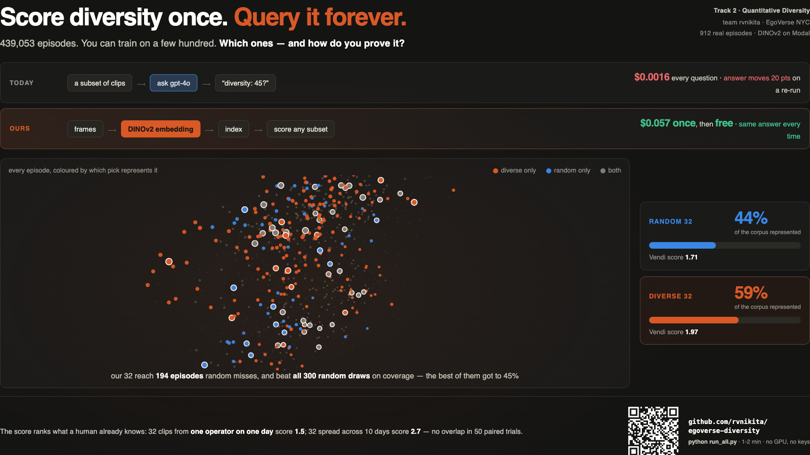
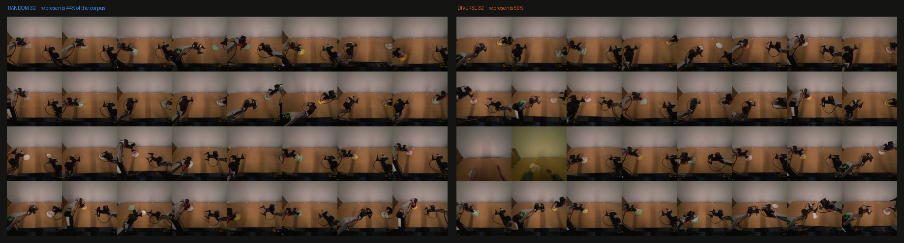

# Score diversity once. Query it forever.

**Track 2 — Quantitative Diversity Measurement.**
EgoVerse Data Optimization & Evaluation Suite, NYC, 15 Aug 2026. Team: rvnikita.

A diversity score for video subsets built from vision embeddings — **no text encoder
anywhere in the pipeline**. It ranks two subsets, it returns the same answer every time,
and once the index exists every further question costs nothing.

### ▶ [**Open the live page**](https://rvnikita.github.io/egoverse-diversity/) — slide on screen one, evidence below

[](https://rvnikita.github.io/egoverse-diversity/)

*The point cloud rotates and the numbers are live — [open it](https://rvnikita.github.io/egoverse-diversity/).
No install needed to look; the command below reproduces every figure on it.*

## The pitch

An LLM-as-a-judge answers "how diverse is this subset?" by describing it in text. That is
one API call per question, a different answer next run, and nothing you can falsify.

We build an **index instead of asking a question**: embed every episode once, then any
subset score is numpy over cached vectors.

| | Vendi over DINOv2 | gpt-4o as a judge |
|---|---|---|
| Same answer twice on the same input | **yes** — identical, bit for bit | no — 20-point spread over 5 calls **at temperature 0** |
| Survives the duplication test | **yes** — Δ −0.047 on exact clones | no — 45 → 67 when 30% of clips are replaced by copies |
| Cost to score one subset | **$0.00** after the index | $0.0016 · 1.5 s |
| Auditable | a number you can recompute | a sentence you cannot |

And it compounds, because an embedding is a **one-off index** while a judge is a
**per-query cost**:

```
index, built once            $0.057    257 s on one L4, all 912 episodes
subsets scored since          1,560    free — the whole sweep replays on a laptop
the same sweep, LLM judge       ~$13    7,800 calls at 1.5 s → ~3 hours, still not reproducible
```

Curation is never one question. It is thousands of subset comparisons in a loop.

## The deliverable: a score that ranks two subsets

```
                Vendi     represents      avg distance to
                score     the corpus      nearest pick
random 32        1.71        44%            0.053
diverse 32       1.97        59%            0.037     <- cluster cover
farthest-point   3.31        10%            0.060     <- highest score, worst subset
```

Selection is **cluster cover** (k-means, then the real episode nearest each centroid),
not farthest-point. That choice is deliberate and measured: FPS maximises the score by
collecting outliers and ends up representing almost nothing. Cluster cover beats random on
**both** the score and coverage, so the metric and the practical benefit agree.

One frame from each episode in the two subsets — the score made visible. The random grid
repeats near-identical clips; the diverse grid does not:



On the shared 3D view, **194 episodes are represented only by the diverse pick** against
**59 only by random** — 3.3× more exclusive coverage for the same budget of 32.

**Is that gap luck?** We measured the random baseline properly — 300 draws of 32:

| | 300 random draws | cluster cover | |
|---|---|---|---|
| Vendi score | 1.93 ± 0.14 (1.67–2.36) | 1.97 | beats only 61% of draws — **inside the noise** |
| share of corpus represented | 36.8% ± 3.3 (best 45.3%) | **59.2%** | beats **all 300**, z = 6.7 |

We print the number that hurts. On Vendi alone our subset sits inside the spread of plain
random sampling; the separation that is real is coverage. Same lesson as the farthest-point
case from the other side: the score alone was never the whole answer.

**And the score ranks what a human already knows**, with no selector involved: 32 clips
from one operator on one day score **1.53 ± 0.13**; 32 spread across all 10 recording days
score **2.69 ± 0.08** — broader wins **50/50 paired trials, zero overlap**.

## The score tracks things it was never shown

The encoder only ever saw pixels. Recording date and the registry's `objects` field were
never part of its input, so coverage of them is **external** evidence rather than the
score admiring its own geometry:

| budget | recording days (of 10) | prop combos (of 12) |
|---|---|---|
| k=8 | random 3.5 → **diverse 5.7** | random 5.6 → **diverse 6.6** |
| k=16 | random 4.7 → **diverse 6.6** (+42%) | random 7.9 → **diverse 9.5** |
| k=32 | random 6.0 → **diverse 8.9** | random 10.0 → **diverse 10.5** |

## Run it

```bash
pip install -r requirements.txt
python run_all.py            # 1-2 min, CPU only, no credentials, no network
open results/index.html
```

Everything regenerates from the 12 MB `results/episode_vectors.npz` committed here.
The GPU stage that built it is optional and separate:

```bash
modal deploy src/modal_embed.py
AWS_PROFILE=egoverse python scripts/build_cup_embeddings.py   # 29,184 frames, 257 s on an L4
```

## Method, and why each piece

- **DINOv2-base**, not CLIP or SigLIP. Self-supervised visual features, no text tower at
  any point — the brief asks for diversity measured "aside from text", and a text-aligned
  encoder would invite exactly the objection the track is written against.
- **Vendi Score** — the exponential of the Shannon entropy of the eigenvalues of the
  normalised cosine kernel. Interpretable units ("effectively 3.3 distinct episodes out of
  32"), no reference distribution required, and exact duplicates provably cannot raise it.
- **32 uniform frames per episode.** We tried to be cleverer and it did not work: four CPU
  keyframe-selection policies all lost to `np.linspace` (`out/cascade_big.log`), and
  keyframe pooling lost to mean pooling on semantic separation (+0.319 vs +0.352). Uniform
  is the measured winner, not the lazy default.
- **Cluster cover** for selection (k-means, then the real episode nearest each centroid),
  so the subset is real data rather than a synthetic centroid. Farthest-point was rejected
  on measurement, not taste — see the table above.

## How it could be fooled

- **Near-duplicates.** Exact copies cannot raise the score. But jitter a copy by a cosine
  distance of 0.0094 — below the **0.0424** that separates genuinely distinct episodes —
  and it starts to inflate, reaching **+0.661** at 0.125. We measured the threshold instead
  of claiming there wasn't one.
- **The long tail.** Farthest-point is the wrong tool for the *last* rare category: it needs
  ~101 episodes to cover all 12 prop combos where random needs ~60. It maximises spread,
  which is not the same as completing a checklist.
- **One task, one lab, one rig, one scene.** All 912 episodes are `cup_on_saucer` from
  `rl2` on `eva_bimanual` against `white_wall`. Constant background kills the "you're just
  measuring rooms" objection by construction, but it also means we have not shown these
  numbers transfer to other tasks.

## Repo map

| Path | What |
|---|---|
| `run_all.py` | one command, reproduces everything on CPU in 1-2 min |
| `results/index.html` | **the deliverable** — slide on screen one, dashboard below |
| `results/slide.html` | the same slide standalone, for a submission form |
| `results/episode_vectors.npz` | 912 × 768 pooled DINOv2 vectors + metadata (committed) |
| `src/diversity.py` | Vendi score, farthest-point, pooling, duplication test |
| `src/modal_embed.py` | DINOv2 embedding service on a Modal L4 |
| `scripts/analysis.py` | coverage, falsification sweep, 3D projection, contact sheets |
| `scripts/llm_judge.py` | the gpt-4o baseline, measured on the same two subsets |
| `scripts/slide_parts.py` | the slide markup, shared by both outputs |
| `scripts/build_dashboard.py` | renders index.html (inline SVG + canvas, no libraries) |
| `scripts/build_slide.py` | renders the one summary slide |
| `scripts/cascade_experiment.py` | the keyframe-selection negative result |
| `docs/egodb-findings.md` | what the registry actually contains, measured today |
| `docs/decisions.md` | why each choice, including the ones that failed |

`scripts/select_experiment.py` additionally measures how each selector's subset performs
as *training data*. That is Track 1/3 territory and is not part of this submission; it
stays in the repo as supporting evidence.

An earlier pre-hackathon kit (voice → open-vocab detection → arm) also lives in `src/`
and is described in `spec.md`. Also not part of this submission.
